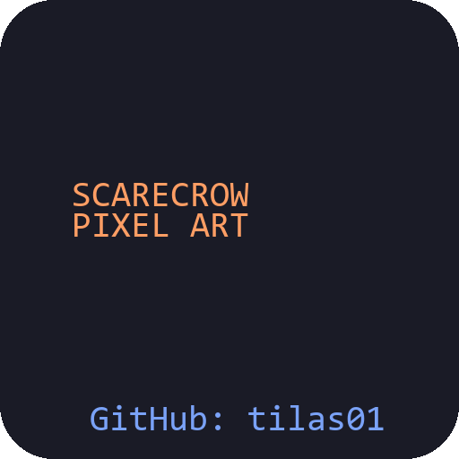
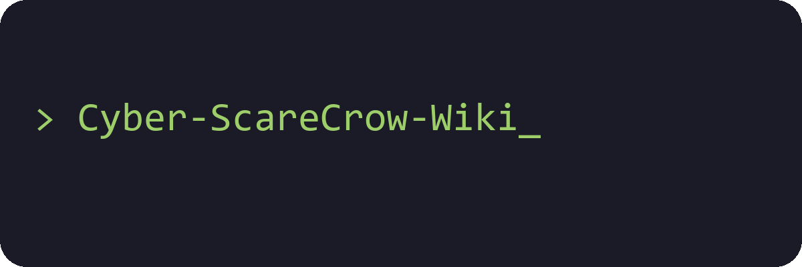

  

# Cyber-ScareCrow-Wiki

**Public Documentation - Open Source Setup Guides**

  

## Table of Contents
- [Overview](#overview)
- [Features](#features)
- [Documentation & Setup](#documentation--setup)
- [License](#license)

## Overview
Official documentation for the Cyber-ScareCrow Public Libre ecosystem.

## Features
*   Reproducible build instructions for the Rust backend and Ring-0 driver.
*   Website deployment strategies via GitHub Actions.

## Legal Disclaimer & AI Content Generation Warning
This software suite incorporates advanced heuristic analysis, dynamic micro-VM sandbox execution, and in some configurations, Ring-0 driver hooks to enforce process integrity. 

**Disclaimer of Warranty:**
This software is provided "as is", without warranty of any kind. In no event shall the authors or copyright holders be liable for any claim, damages or other liability.

**AI Content Generation Warning:**
Users should be aware that certain components of the threat analysis reports may utilize artificial intelligence. These outputs should be reviewed by a qualified security professional. 

